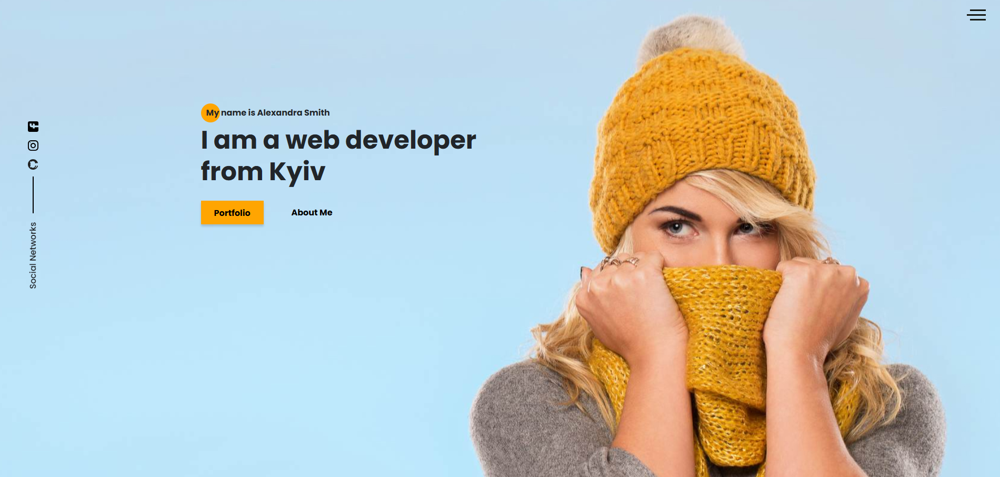

# Responsive Website with CSS Grid and Contact Form

This project is a fully responsive website built with CSS Grid, featuring a sliding menu, a contact block for data submission, and an additional page for privacy policy with a checkbox. The project uses Gulp for task automation, SCSS for modular styles, Bootstrap for browser reset, and CSS Grid for layout flexibility. The website is optimized for all devices and provides a smooth user experience.

## Live Demo
You can view the live version of this website at:
https://reliable-pothos-8863e4.netlify.app/

## Features

- **CSS Grid Layout**: The website layout is built using CSS Grid, providing a flexible and responsive structure.
- **Responsive Design**: The layout adapts to various screen sizes, ensuring a seamless experience on all devices.
- **Sliding Menu for All Devices**: A smooth sliding navigation menu that works on all screen sizes.
- **Contact Form**: A contact section for sending data, with appropriate validation.
- **Privacy Policy Page**: A dedicated page for privacy policy, with a checkbox for user consent.
- **Tools and Libraries**:
   - Gulp for task automation and file handling.
   - SCSS for modular, maintainable styling.
   - **Bootstrap-reboot** for resetting browser default styles.
   - **CSS Grid** for flexible layout design.

## Technologies Used

- HTML5
- CSS3 (Grid, SCSS)
- JavaScript
- Gulp (for task automation)
- **Bootstrap-reboot** (for resetting CSS styles)

## Installation

1. Clone the repository:
   ```bash
   git clone https://github.com/yurazablotskiy/Portfolio_starter.git
